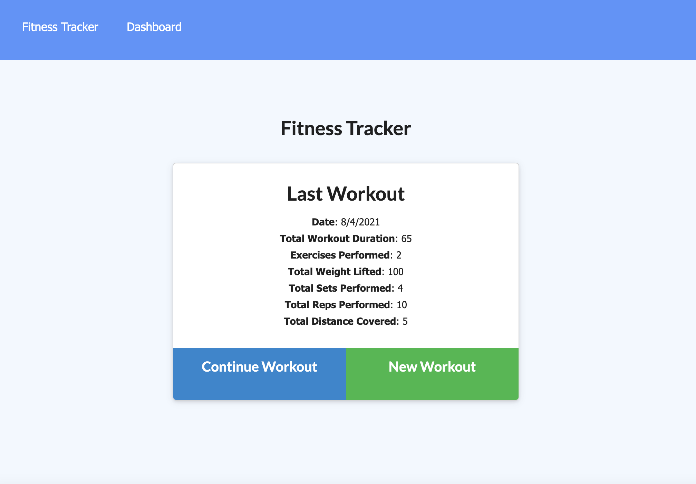
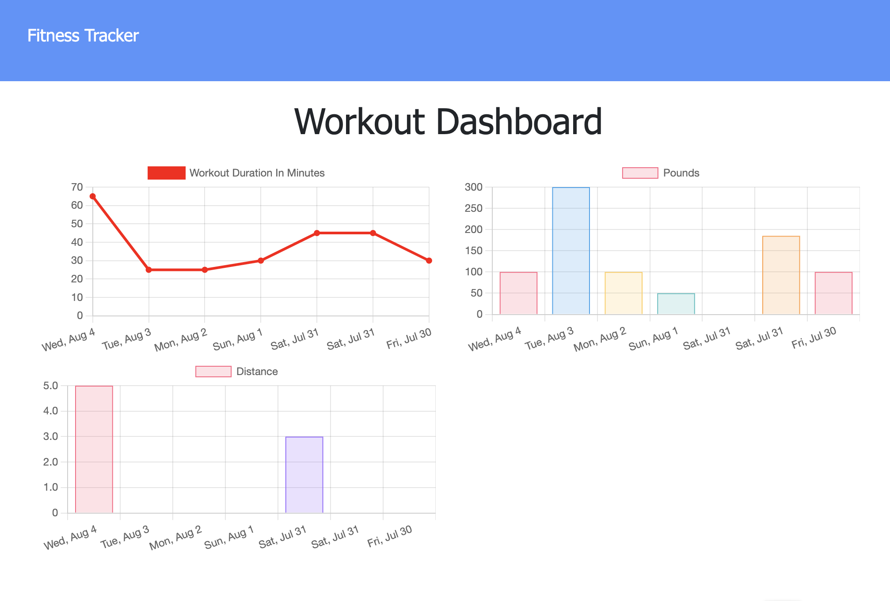
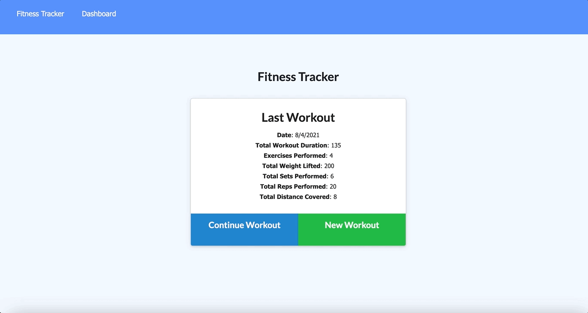

# Nosql Workout Tracker

 

## Description

A [Nosql Workout Tracker](https://fitnesstracker072021.herokuapp.com/?id=610ad82ab997cd0015123b6a) created to allow the user to enter and track workout statistics for the last seven days. By adding to a current workout or by adding a new workout, the user can track their statistics on the **Dashboard** in the form of graphs. A line graph shows workout duration in minutes and their are two bar graphs for the type of exercises: one for the pounds lifted during resistance exercises and another for distance during cardio exercises. This application utilizes [MongoDB](https://www.mongodb.com/) to store and fetch data from current and past workouts rather than a Mysql database.

## Table of Contents

- [About the Project](#about-the-project)
- [Installation](#installation)
- [Usage](#usage)
- [Contributing](#contributing)
- [Tests](#tests)
- [License](#license)
- [Questions](#questions)

## About the Project

- This project is a Nosql application built utilizing [MongoDB](https://www.mongodb.com/).
- The user can add to current workouts or add a new workout.
- Depending on the type of exercise entered, the user will input either the name, distance and duration, or the name, weight, reps, sets, and duration.
- The **Dashboard** allows the user the ability to view their last seven workouts using a line graph and bar graphs.
- An additional bar graph was added to show the distance from cardio from the last seven workouts.
- This project was deployed on [Heroku](https://www.heroku.com) and connected to [MongoDBAtlas](https://www.mongodb.com/cloud/atlas/lp/try2?utm_source=google&utm_campaign=gs_americas_united_states_search_core_brand_atlas_desktop&utm_term=mongodb%20atlas&utm_medium=cpc_paid_search&utm_ad=e&utm_ad_campaign_id=12212624338&gclid=CjwKCAjw9aiIBhA1EiwAJ_GTSiMeUA88Ve_kTtEtHUYP_veuiRJcw_j8htZeHqqp6zjXuUAIeH2w1hoC2v8QAvD_BwE) to create, update, and fetch workouts.
- Built with the following technologies:
  - [path](https://www.npmjs.com/package/path)
  - [express](https://www.npmjs.com/package/express)
  - [mongoose](https://www.npmjs.com/package/mongoose)
  - [morgan](https://www.npmjs.com/package/morgan)
  - [HTML](https://www.w3schools.com/html/), [CSS](https://www.w3.org/Style/CSS/Overview.en.html), and [Javascript](https://www.javascript.com/)
  - [Bootstrap](https://getbootstrap.com/)
  - [Chart.js](https://www.npmjs.com/package/chart.js)

## Installation

- Open [Workout Tracker](https://github.com/twashke/Nosql-Workout-Tracker)
- Use the command line to **git clone**
- **npm install**
- Must have [MongoDB](https://www.mongodb.com/) installed locally
- **node seeders/seed.js** to drop seeds in command line.
- **npm start** from command line to connect server.
- Go to [localhost:3001](http://localhost:3001/) in Web Browser to view.

## Usage

- Go to [Deployed Workout Tracker](https://fitnesstracker072021.herokuapp.com/?id=610ad82ab997cd0015123b6a)
- From the **Fitness Tracker** main page, the information from the last workout can be viewed.
- To add a new workout, click **New Workout**.
- To add to the previous workout, click **Continue Workout**.
- **Add Your Exercise** by choosing **Exercise Type** from the drop down (either cardio or resistance).
- For **cardio** enter the name of cardio, the distance and the duration.
- For **resistance** enter the name of the cardio, the weight, the reps, sets and duration.
- Once all information is entered hit **Complete** to finish, or click **Add Exercise** to add more.
- Use the **Dashboard** to view the following information:
- A line graph showing the **Workout Duration in Minutes** for the last seven workouts.
- A bar graph showing the **Pounds** lifted in the last 7 workouts.
- Added an additional bar graph showing the **Distance** from cardio in the last seven workouts.

**Fitness Tracker** with last workout statistics
 \
\
**Workout Dashboard** with past workouts
 \
\
**Adding to Workout** multiple exercises
 \
\
**Update to Dashboard** to show new statistics

## Contributing

- Front end code provided for the project (added new bar graph to stats page to show distance for cardio workouts).

## Tests

- Tested that data is being saved and fetched as intended using Nosql.

## License

This application is covered by the [MIT License](https://opensource.org/licenses/MIT).

      Copyright 2021 Tiffany Washke

      Permission is hereby granted, free of charge, to any person obtaining a copy of this software and associated documentation files (the "Software"), to deal in the Software without restriction, including without limitation the rights to use, copy, modify, merge, publish, distribute, sublicense, and/or sell copies of the Software, and to permit persons to whom the Software is furnished to do so, subject to the following conditions:

      The above copyright notice and this permission notice shall be included in all copies or substantial portions of the Software.

      THE SOFTWARE IS PROVIDED "AS IS", WITHOUT WARRANTY OF ANY KIND, EXPRESS OR IMPLIED, INCLUDING BUT NOT LIMITED TO THE WARRANTIES OF MERCHANTABILITY, FITNESS FOR A PARTICULAR PURPOSE AND NONINFRINGEMENT. IN NO EVENT SHALL THE AUTHORS OR COPYRIGHT HOLDERS BE LIABLE FOR ANY CLAIM, DAMAGES OR OTHER LIABILITY, WHETHER IN AN ACTION OF CONTRACT, TORT OR OTHERWISE, ARISING FROM, OUT OF OR IN CONNECTION WITH THE SOFTWARE OR THE USE OR OTHER DEALINGS IN THE SOFTWARE.

## Questions

**Contact Tiffany Washke**

- **Email directly at** twashke@gmail.com
- **GitHub User Name:** [twashke](https://github.com/twashke)

